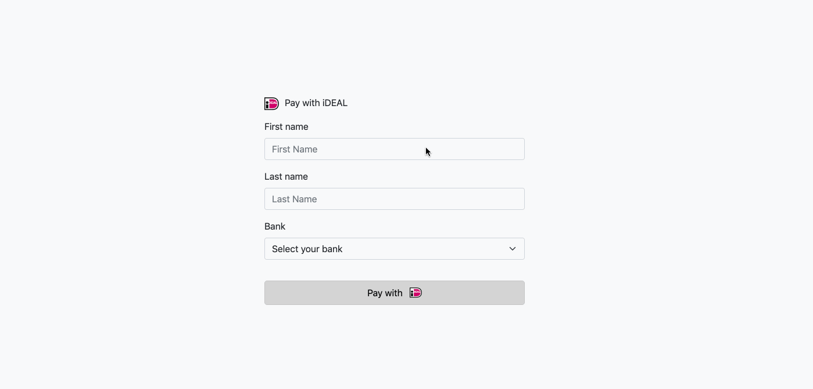

# API Intergration with iDEAL 


This integration uses Paypal's REST API to accept iDEAL payments


See a [hosted version](https://demo-ideal-api-intergration.herokuapp.com/)

**Features:**
- EUR Bank transfers 💶
- Paypal REST API intergration 
- Webhooks events, on authorize  🪝


**Demo:** 

<p align="center">
  
</p>

### How to run locally

Copy the .env.example file into a file named .env

```
cp .env.example .env
```

and configuring your .env config file with your Paypal API keys.

1. Clone the repo  `git clone git@github.com:paypal-examples/ideal-api-intergration.git`
2. Run `npm install`
3. Run `npm start`
4. Navigate to http://localhost:8080/


&nbsp;

###### Credits

Shaylan Dias
